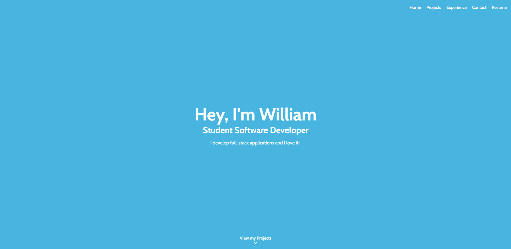

# willqizza.github.io | willqi.dev

Hi there! My name is William Qi! Welcome to my portfolio repository! The repository is composed of the source code of my personal portfolio site.

This project was built in my spare time using a mixture of both `TypeScript` and `ReactJS` and is available over at [willqi.dev](https://willqi.dev) if you'd like to take a look!

## How To Run (Local)

- `git clone https://github.com/WillQizza/WillQizza.github.io.git`
- `cd WillQizza.github.io`
- `npm install`
- `npm run-script start`
- Navigate to `localhost:3000` and feel free to look around!

## How To Run (Kubernetes)

- `kubectl apply -f https://raw.githubusercontent.com/WillQizza/WillQizza.github.io/master/kubernetes.yaml`

## How To Run (Docker)

- `git clone https://github.com/WillQizza/WillQizza.github.io.git`
- `cd WillQizza.github.io`
- `docker build -t portfolio:1 .`
- `docker run -p 3000:80 --name portfolio --restart always portfolio:1`
- Navigate to `localhost:3000` and feel free to look around!
